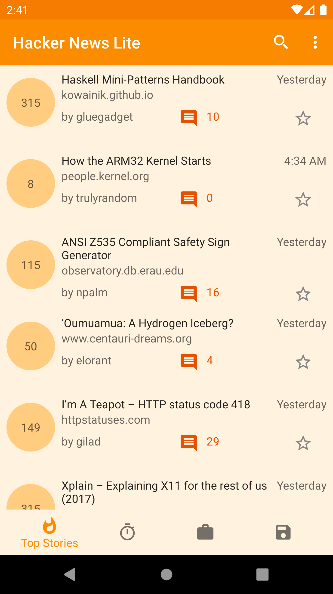
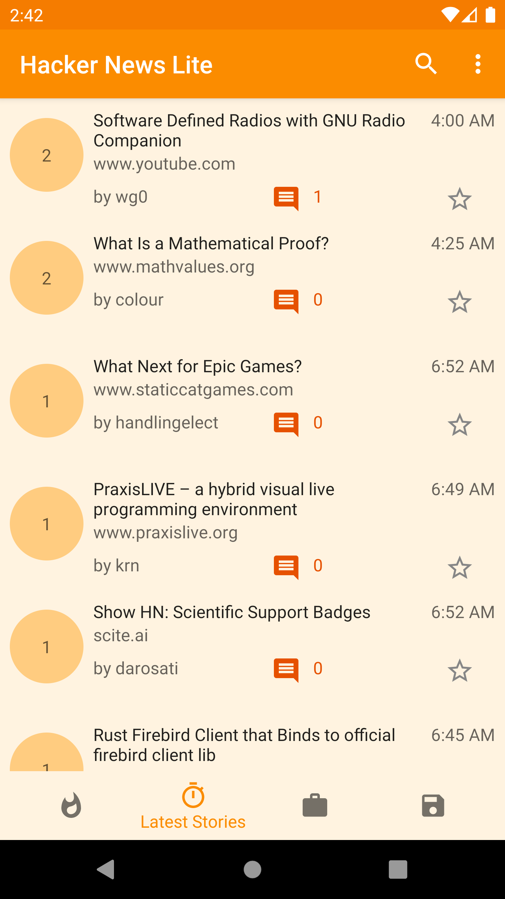
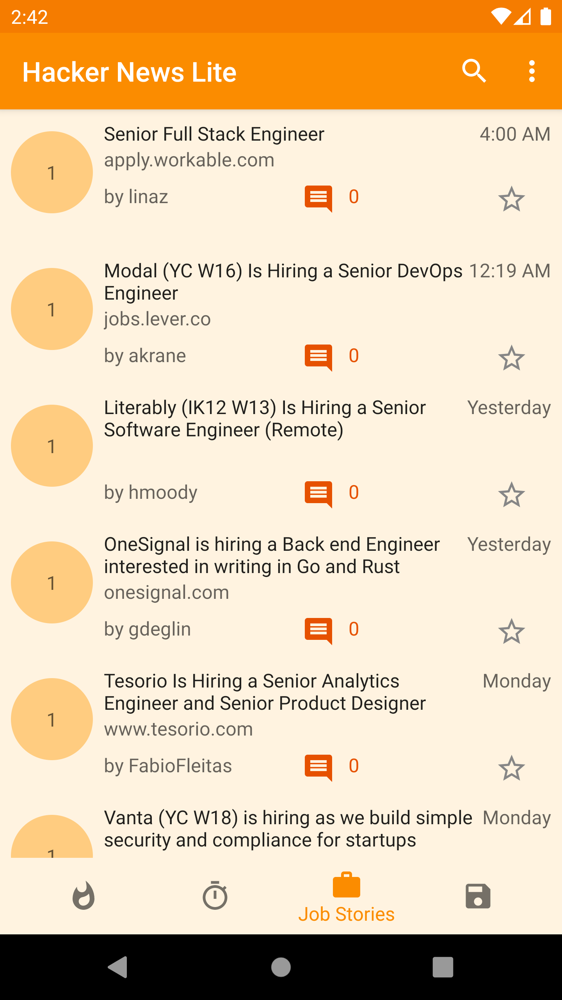
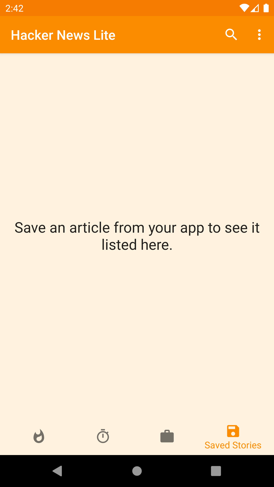
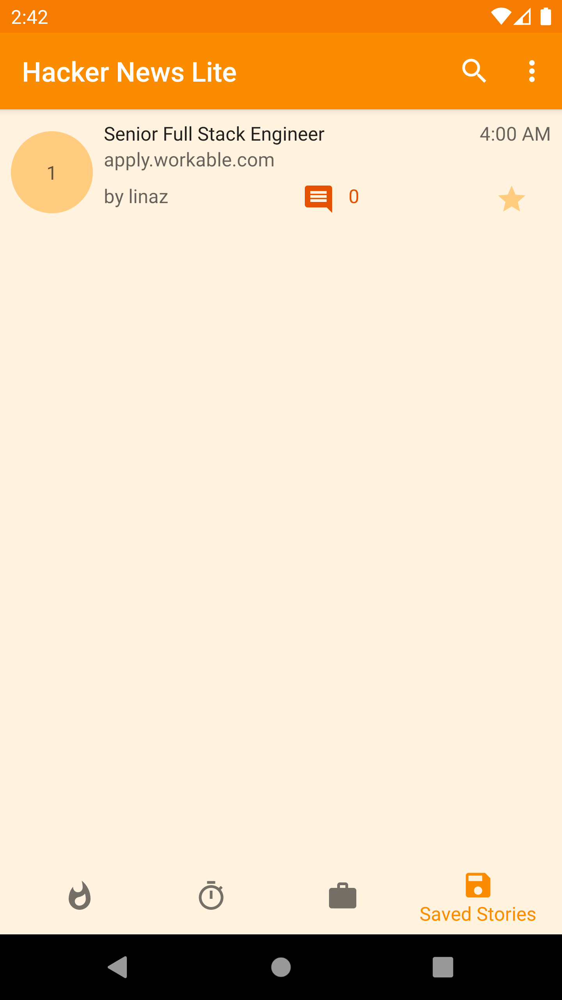
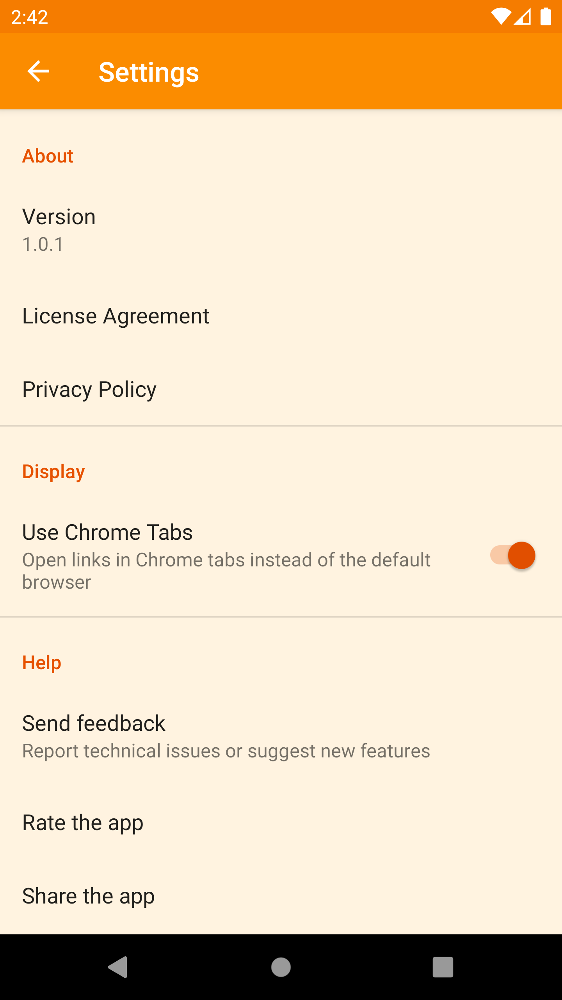

Hacker News Lite is a Material design [Hacker News] client for Android which uses the official [HackerNews/API].This is a light weight app to consolidate all the happenings from hacker news in one place. Ability to save the news you like is the cherry on the cake.

Features:

⋅⋅* Browse Top stories, Latest stories and Job stories from Hacker News
⋅⋅* Search for specific stories from Hacker News
⋅⋅* Share stories with your friends, colleagues or loved ones
⋅⋅* Save stories for viewing them later.
⋅⋅* Supports reading stories in external Chrome tabs

[![Get it on Google Play][Play Store Badge]][Play Store]

### Setup
**Requirements**
- Latest Android SDK tools
- Latest Android platform tools
- Android SDK 28
- AndroidX

### Screenshots

### License

    Copyright 2020 Srijith Reddy Pingili
    
    Licensed under the Apache License, Version 2.0 (the "License");
    you may not use this file except in compliance with the License.
    You may obtain a copy of the License at
    
        http://www.apache.org/licenses/LICENSE-2.0
    
    Unless required by applicable law or agreed to in writing, software
    distributed under the License is distributed on an "AS IS" BASIS,
    WITHOUT WARRANTIES OR CONDITIONS OF ANY KIND, either express or implied.
    See the License for the specific language governing permissions and
    limitations under the License.

[Hacker News]: https://news.ycombinator.com/
[HackerNews/API]: https://github.com/HackerNews/API
[Play Store Badge]: https://play.google.com/intl/en_us/badges/static/images/badges/en_badge_web_generic.png
[Play Store]: https://play.google.com/store/apps/details?id=sp.android.hackernewslite.play
